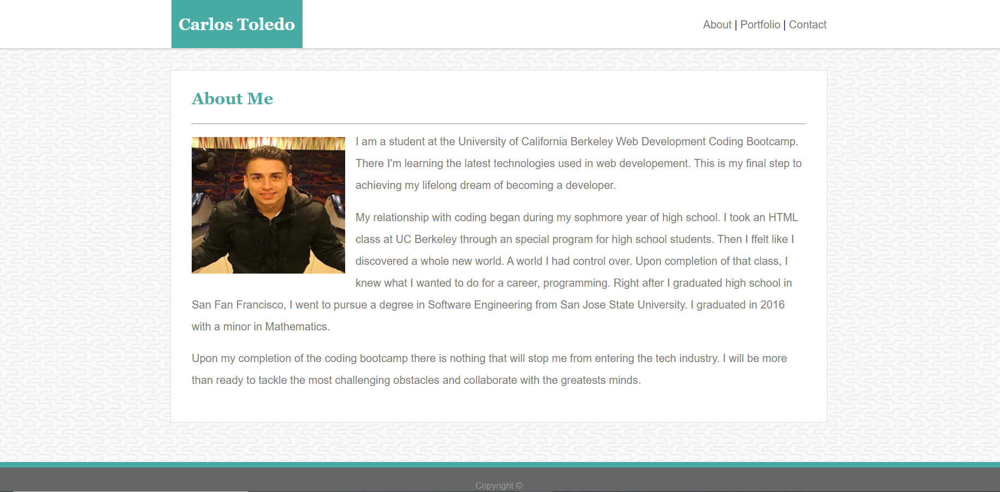
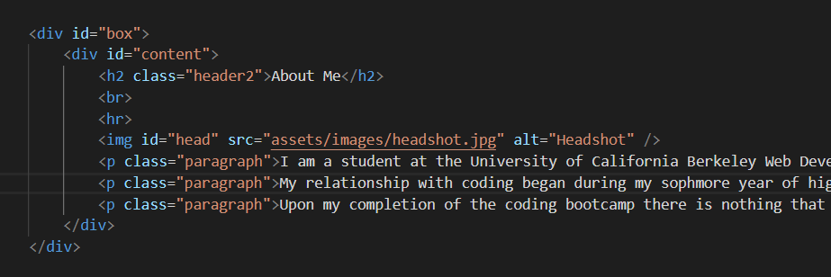
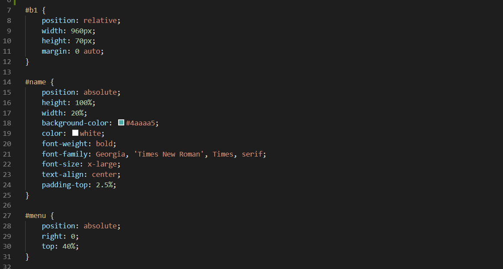

# Portfolio

This website contain professional information about me and show some of the projects that I have worked on.

## Getting Started

This document contains information on the code writen for the Portfolio website. It has explained snippets of code for reference. It also includes a link to the live site and the repository on Github.

## Site Picture

## Code Snippets

This code shows the nesting I chose to display the main content of the webpage. There is a &lt;div&gt; 'box' that takes care of the background. Inside there is a &lt;div&gt; 'content' that contains the main content of the webpage. This includes the header, image, and text. The &lt;p&gt; tags belong to the same class "paragraph" for easier styling.

This snippet shows the styling of the &lt;header&gt;. The header 'b1' was centered using margin: 0 auto. The 'name' and the 'menu' were position absolute in relation to the header.

## Built With

* [HTML](https://developer.mozilla.org/en-US/docs/Web/HTML)
* [CSS](https://developer.mozilla.org/en-US/docs/Web/CSS)

## Deployed Link

* [See Live Site](https://kqarlos.github.io/Portfolio/index.html)

## Authors

* **Carlos Toledo** 

- [Link to Portfolio Site](https://github.com/kqarlos/Portfolio)
- [Link to Github](https://www.github.com/kqarlos)
- [Link to LinkedIn](https://www.linkedin.com/in/carlos-toledo415/)

## Acknowledgments

* [W3 Schools](https://www.w3schools.com/)
* [CSS Tricks](https://css-tricks.com/couple-takes-sticky-footer/)
